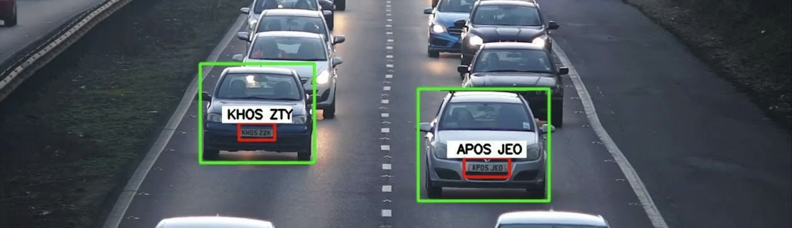
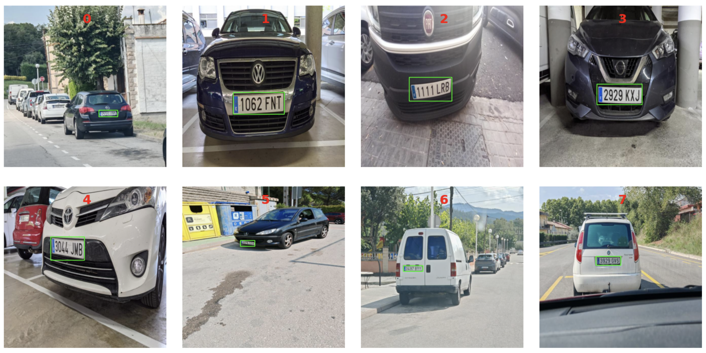
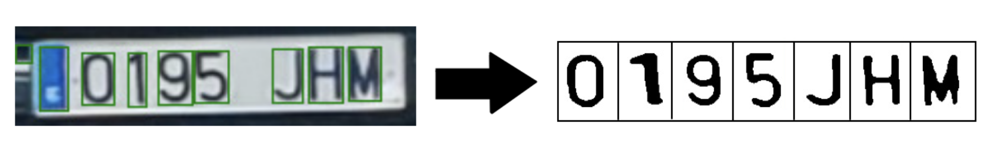
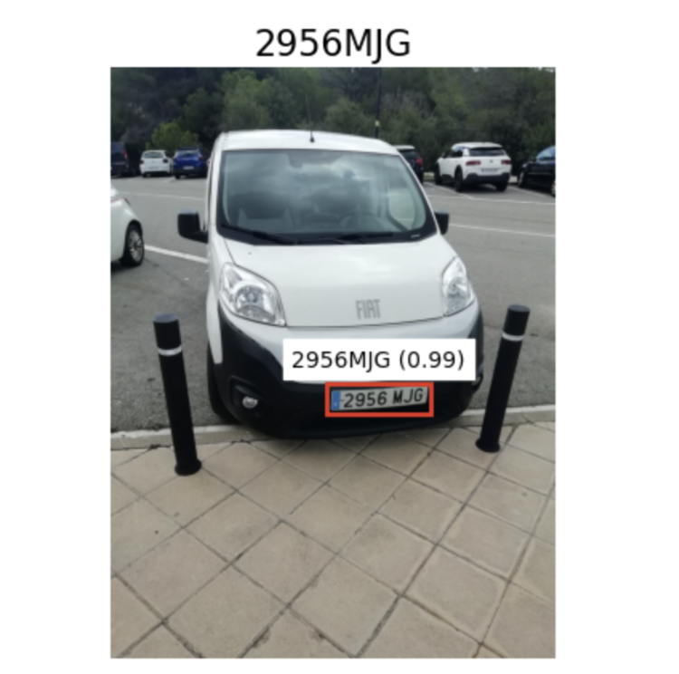
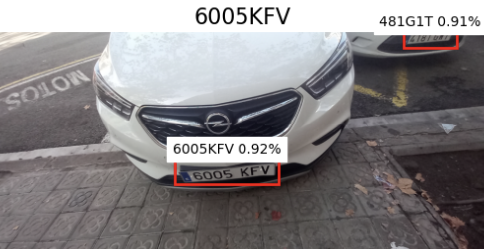
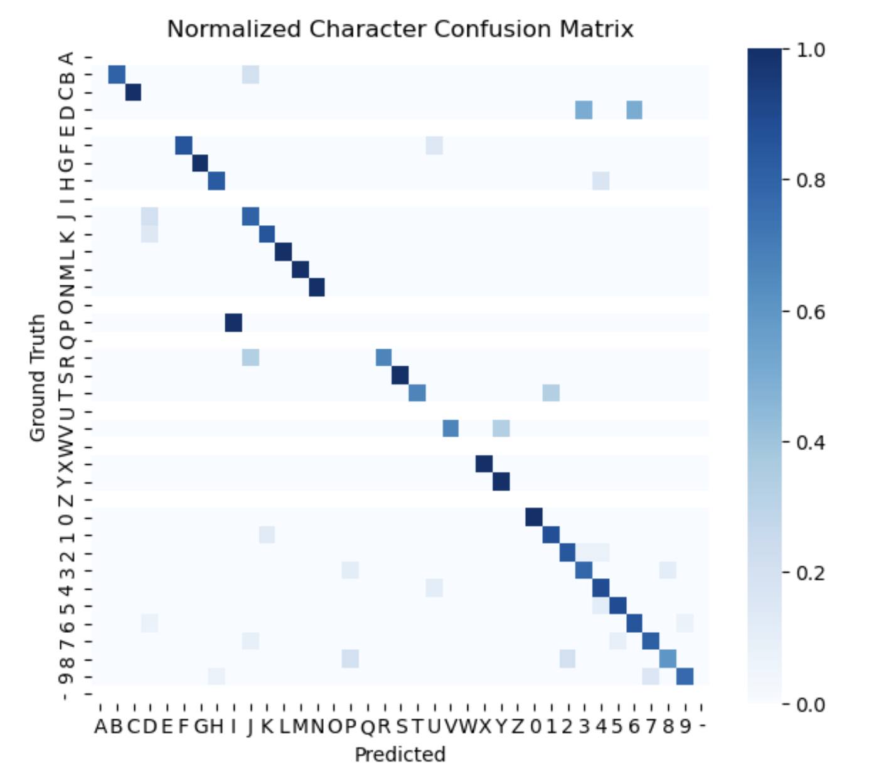

# ANPR-GIA: Automatic Number-Plate Recognition

<p align="center">
  
</p>


*An automated system for detecting and recognizing Spanish license plates using YOLO11 and PaddleOCR*

For detailed methodology, experiments, and analysis, please refer to the **[full report](https://github.com/marinocom/ANPR-GIA/blob/main/AN-PR%20Report.pdf)**.

## Overview

This project implements a complete **Automatic Number-Plate Recognition (ANPR)** pipeline  designed for Spanish license plates. Spanish license plates have a specific layout consisting of 4 digits and 3 character letters in all caps using the 'Alte DIN 1451 Mittelschrift' font family. They typically consist of a white rectangle with a small blue section on the left containing the letter 'E' for España/Spain. 


The system:

1. **Detects** license plates in images using fine-tuned YOLO11
2. **Segments** individual characters through morphological operations
3. **Recognizes** text using PaddleOCR


## Installation

1. **Create a virtual environment**
```bash
conda env create -f environment.yml
conda activate yolo
```

2. **Install PyTorch** (choose based on your system)

For macOS:
```bash
conda install pytorch::pytorch torchvision -c pytorch
```

For Windows/Linux with Nvidia GPU:
```bash
conda install pytorch torchvision pytorch-cuda=11.8 -c pytorch -c nvidia
```

For Linux with AMD GPU:
```bash
pip install torch torchvision --index-url https://download.pytorch.org/whl/rocm6.0
```

For CPU only:
```bash
conda install pytorch torchvision cpuonly -c pytorch
```

---

## Repo Structure
```
ANPR-GIA/
├── pipeline.py                 # Main pipeline implementation
├── Models/
│   └── yolo11n_licenseplates.pt   # Trained YOLO11 model
├── notebooks/
│   ├── evaluation.ipynb           # Pipeline evaluation and examples
│   ├── yolo11.ipynb              # YOLO training process
│   ├── comparisonOCR.ipynb       # OCR methods comparison
│   ├── segmentation.ipynb        # Character segmentation tests
│   └── ...                       # Additional experimental notebooks
├── data/
│   ├── test/                     # Test images
│   ├── frontal/                  # Frontal view images
│   └── lateral/                  # Lateral view images
├── AN-PR_Report.pdf             # Detailed project report
└── README.md
```

### Key Files

- **`pipeline.py`**: Complete implementation of the ANPR pipeline
- **`notebooks/evaluation.ipynb`**: Examples and performance metrics
- **`notebooks/yolo11.ipynb`**: YOLO11 training and fine-tuning
- **`notebooks/comparisonOCR.ipynb`**: Comparison of Tesseract, EasyOCR, and PaddleOCR
- **`notebooks/comparisonYoloMathMorph.ipynb`**: Detection methods comparison
- **`notebooks/segmentation.ipynb`**: Character segmentation evaluation
- **`notebooks/customOCR.ipynb`**: Custom CNN training attempts
- **`notebooks/mathMorph.ipynb`**: Mathematical morphology detection approach
- **`notebooks/generate_dataset_recognition.ipynb`**: Synthetic dataset generation


## Methodology

### 1. Detection (YOLO11)

We fine-tuned YOLO11n on a custom dataset of Spanish license plates:
- **Dataset**: 333 images (291 train, 14 validation, 28 test)
- **Augmentation**: Horizontal flips, rotation (±10°), noise injection (0.18% of pixels)
- **Performance**: 92.86% precision, 100% recall on test set


<p align="center">
  
</p>

<br>

*Alternative tested approach*: We also implemented a mathematical morphology + template matching approach, but it achieved only 38.46% precision and recall, leading us to select YOLO11 for the final pipeline.

### 2. Segmentation

Character segmentation using morphological operations and contour detection:

*Process:*
1. Resize plates to 200x50 pixels
2. Convert to grayscale
3. Find contours to locate character regions
4. Apply multiple filters:
    
    - Size filter: Keep shapes with area 70-800 pixels and aspect ratio 0.1-2.0
    
    -Hierarchy filter: Remove holes inside characters (6, 8, 9, 0)
    
    -Color filter: Remove blue shapes (EU section)
    
    -Blob filter: Remove blobs using erosion (noise reduction)

<p align="center">
  
</p>

<br>

### 3. Recognition (PaddleOCR)

PaddleOCR selected after thorough comparison:

| Method | Accuracy | ANLS | Avg. Time |
|--------|----------|------|-----------|
| Tesseract | 0.108 | 0.579 | 0.208s |
| EasyOCR | 0.174 | 0.625 | 0.094s |
| **PaddleOCR** | **0.563** | **0.799** | **0.132s** |

<p align="center">
  
</p>

<br>

Double plate recognition was also achieved


<p align="center">
  
</p>

<br>

## Results

### Overall Performance

| Dataset | Accuracy | NLS | Avg. Confidence | Character F1 |
|---------|----------|-----|----------------|-------------|
| Test Set | 0.5714 | 0.8352 | 0.8358 | 0.8439 |
| **Frontal** | **0.8666** | **0.9756** | **0.9426** | **0.9712** |
| **Lateral** | **0.7059** | **0.9480** | **0.9288** | **0.9060** |

### Detection Comparison

| Method | Precision | Recall |
|--------|-----------|--------|
| **YOLO11** | **92.86%** | **100%** |
| MathMorph + Template | 38.46% | 38.46% |


## Evaluation Metrics

### Detection/Segmentation
- **IoU (Intersection over Union)**: Measures overlap between predicted and ground truth bounding boxes

### Recognition
- **Accuracy**: Rate of exactly correct predictions
- **NLS (Normalized Levenshtein Similarity)**: Measures closeness to ground truth, allowing for small mistakes
- **Character-level metrics**: Precision, Recall, F1-score at individual character level
- **Confusion Matrix**: Identifies most commonly confused characters

### Character Confusion Matrix

The most commonly confused characters:
- 9 ↔ 7
- B ↔ J
- D ↔ 3, 6
- F ↔ U

<p align="center">
  
</p>
<br>

## Technical Details

### Spanish License Plate Format

- **Structure**: 4 digits + 3 letters (e.g., 0195 JHM)
- **Font**: Alte DIN 1451 Mittelschrift
- **Layout**: White rectangle with blue EU section on the left
- **Variations**: Size differences for motorcycles and certain car models

### Model Information

- **YOLO11n**: Nano version optimized for speed and efficiency
- **Model weights**: Available on [HuggingFace](https://huggingface.co/Pikurrot/yolo11n-licenseplates)
- **Architecture**: C3k2 blocks + C2PSA for spatial attention
- **Input size**: 640x640 pixels

## Team

This project was developed as part of the **Vision & Learning** course at **Universitat Autònoma de Barcelona (UAB)**.

**Team Members:**
- Luis Domene García 
- Eric López Cervello 
- Marino Oliveros Blanco 

**Date:** October 15, 2024

## References

1. ANLS: Biten et al., "Scene text visual question answering," ICCV 2019
2. YOLO: "You Only Look Once: Unified, Real-Time Object Detection," arXiv:1506.02640
3. PP-OCR: "A Practical Ultra Lightweight OCR System," arXiv:2009.09941
4. OpenCV Template Matching [Documentation](https://docs.opencv.org/4.x/d4/dc6/tutorial_py_template_matching.html)
